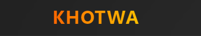

# Khotwa



**Share goals. Get support.**

Khotwa is a community platform where you can share your goals, earn tokens from engagement, and get verified approval from peers.

## Features

- Share goals and track progress
- Get support through likes, comments, and approvals
- Earn tokens from engagement (bonus when verification > 70%)
- Feed, Groups, Profile, and Chat
- Dark & Light theme
- Goal reminders

## Technologies

- React 19
- Vite 7
- Tailwind CSS 4
- Motion
- React Router
- React Icons

## Team

**Team Leader:** oussama barhoumi

**Contributors:** 
-Douaeelyaaqoubi
-ChoroukMouaky
-Nour el houda OKMID
-zak-ari0
-hamza_enneiymy
-Ayoub Ennaciri


## Getting Started

**Prerequisites:** 
Node.js v18+

```bash
git clone   https://github.com/oussama-barhoumi/KHOTWATI.git
cd khotwa
npm install
npm run dev
```


## How to Use

**Visitors:** 
Home → Sign up or Log in

**Logged in:** 
Feed (browse, like, comment, approve) 
· Groups 
· Profile 
· Chat

**Token System:** 
100 likes = 10 tokens 
· 20 comments = 5 tokens
· 10 approves = 15 tokens 
· Verification > 70% = +25 bonus
